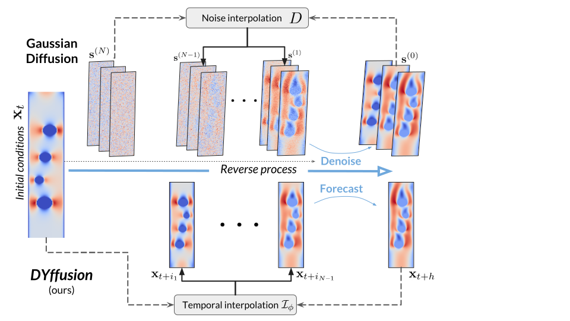

# DYffusion:  Dynamics-informed Diffusion Model for Spatiotemporal Forecasting
**Official implementation of DYffusion. *Code coming soon!***

## Abstract
*While diffusion models can successfully generate data and make predictions, they are predominantly designed for static images.
We propose an approach for training diffusion models for dynamics forecasting that leverages the temporal dynamics encoded in the data, directly coupling it with the diffusion steps in the network.
We train a stochastic, time-conditioned interpolator and a backbone forecaster network that mimic the forward and reverse processes of conventional diffusion models, respectively.
This design choice naturally encodes multi-step and long-range forecasting capabilities, allowing for highly flexible, continuous-time sampling trajectories and the ability to trade-off performance with accelerated sampling at inference time.
In addition, the dynamics-informed diffusion process imposes a strong inductive bias, allowing for improved computational efficiency compared to traditional Gaussian noise-based diffusion models.
Our approach performs competitively on probabilistic skill score metrics in complex dynamics forecasting of sea surface temperatures, Navier-Stokes flows, and spring mesh systems.*

